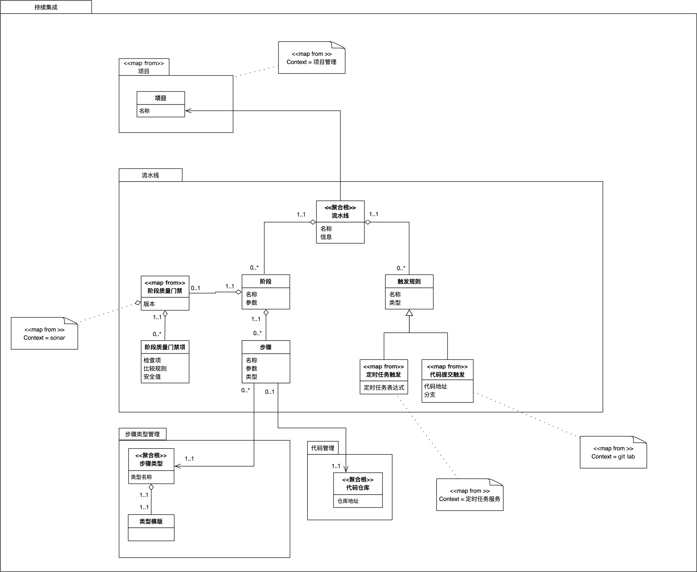

【第一部分】
# **DDD诊所病例 —— 聚合肥大症**
【按】“DDD诊所”是Thoughtworks DDD社区的一项活动，通过对同事们在实施DDD过程中遇到的问题进行分析和解答，共同提高开发水平。我们将其中一些典型案例整理成文供大家参考。之后也会考虑在适当的时候将这一形式对外部开放。

就诊日期：2022年6月8日

主治医师：老钟医 钟敬老师

患者：某Devops平台流水线部分

患者监护人：付施威

诊金：0元（免费义诊）
### **【患者主诉】** 
#### **背景**
在某Devops平台开发过程中，有一个持续交付流水线设计的功能，这个功能中，用户可以在设计页面设计整个流水线，完成以下功能：

1. 给流水线设计前置触发条件，主要有两种触发方式，一种是某个代码仓库提交触发，另一种是定时任务，不限数量
1. 给流水线设计不同的阶段，诸如开发阶段、测试阶段等，并给每个阶段设置不同的步骤，诸如Checkout、编译、构建镜像和部署等
1. 可以选择给阶段设置质量门禁，门禁具体参数诸如单元测试覆盖率大于百分之八十之类，在质量门禁管理功能完成，在流水线执行的时候，如果不满足门禁指标即阻止流水线进入下一个阶段。


*持续交付流水线界面原型*

项目监护人拿到需求以后，做了如下领域模型：



​                                                                   *持续交付流水线领域模型*

这样设计的原因是因为界面的一次性操作，在技术实现上明显是一个事务，将质量门禁、阶段、触发规则都放在了一个流水线这一个聚合里。

注：上图中的<<map from>> 是一种自定义的衍型，意味该对象映射自其他上下文。

这个时候一些问题也出现了：
#### **引发问题**
##### **1. 认知负载上升**
流水线聚合共有7个Entity（不包括抽象类），每一个都有相应的属性，需要进行维护，这个聚合的知识略有些多。另外，由于这部分需要集成不同的外部依赖系统，诸如质量门禁要集成Sonar，定时任务触发要集成定时任务组件，代码提交触发需要集成gitlab或github等代码托管平台，虽然可以通过Repository 模式和依赖倒置（Dependence Inversion Principle，DIP）原则进行了功能与实现的隔离，但或多或少相应的开发或者维护人员仍然需要掌握相关知识。谁要接手了这部分功能中其中一个功能的维护，比如修改质量门禁相关的一些功能，四舍五入相当于接手整个系统。
##### **2. 部分可用性的可能性被牺牲**
这一个功能集成了这么多三方系统，在一个聚合的前提下，整个聚合需要同步的进行操作，从而这些功能中的任何一部分不可用所有的功能都不可用，难以做到部分可用性，比如Sonar 服务临时不可用，也会导致相应的代码触发和阶段维护的不可用，假设某天，需求方提出Sonar不可用的时候，要提示质量门禁设置失败，其他部分要照常保存的时候，必然会破坏整个聚合的一致性边界。糟糕，不知不觉设计了一个分布式单体架构。

**分布式单体架构** ： 是指同时具备分布式和单体的劣势的一种架构，一方面不具备分布式系统的可用性提升，弹性扩容等美好的特性，另一方面不具备单体架构ACID强一致性便于实现的便捷，通常出现在未经良好设计的微服务风格的分布式软件中。
##### **3. 牺牲了性能和并发性**
现在的交互设计是一次提交对流水线的所有变更，用户不见得每次修改都是修改包括质量门禁、阶段、触发规则的所有的部分都刷新一遍，由于聚合的这种模式的特征，我们每次都是对这些部分都进行整存整取，本身只是为了修改其中一部分例如“触发规则”，就需要将Pipeline的整个7个模型都进行更新，有很大的性能浪费。而且，如果两个用户同时操作业务上互不影响的两部分如“触发规则”和“质量门禁”时，会相互冲突，有一个用户要被提示“设计已变更，修改失败”，降低了系统的吞吐量。
### **【诊断】**
初步诊断，**患者的病情主要是聚合肥大症**，即将聚合设计不合理，导致聚合过大。不能合理的划分聚合是DDD实践中经常遇到的问题。

#### **聚合肥大症的征兆**
在DDD的落地实践过程中，聚合的大小经常被描述为一个不可言说的知识，很多时候凭经验、凭感觉造成了落地的困难，在实践中，识别大聚合仍然是有迹可循的，一般来说，出现了这三种情况，就需要警惕了：
##### **1. 宽聚合** 
一个聚合根聚合了多个同级实体，一个“父亲”多类 “ 儿子”如图所示：一旦超过三就有大聚合的风险。
##### **2. 深聚合** 
` `聚合根聚合了一个实体，这个实体又是另一个实体的聚合如此反复 例如“父亲” “儿子” “孙子” “重孙 ”，一旦出现了到了三层就有大聚合的风险。

##### **3. 胖聚合** 
虽然结构简单，但实体对象实例多，如果过多的实体的情况在业务中经常发生，那这里也有大聚合的风险。


【第二部分】
                                                             *聚合肥大的三个征兆*

#### **聚合肥大症的症状**
聚合肥大症导致的问题也像案例描述中一样，主要包括以下三点：

##### **1. 认知负载上升**

提升代码复杂度，导致认知负载提升，我们在做软件设计的时候，需要考虑一个聚合中，负担尽量少的责任，从而降低代码的复杂度，进而提高软件的可维护性。但是大聚合往往意味着包含大量的业务知识，自然而然就难以维护了。
##### **2. 部分可用性的可能性被牺牲**
因为聚合模式下，整个聚合相互关联，如果聚合过于肥大，说明其包含过多的业务部分，一旦部分失效，则整体都可能不可用。
##### 3. **性能问题**
过大的聚合会导致很多不必要的的性能浪费，三种模式的肥大聚合都包含比较多的对象，读取和存储的成本都较高。


### **【病理分析】**
出现大聚合，很可能是聚合划分的不合理，我们回到DDD原书中找找聚合模式的定义，看一看应该怎样划分聚合。
#### **怎样合理的划分聚合**
原书中聚合的定义如下：
```
在具有复杂关联的模型中，要想保证对象更改的一致性是很困难的。需要维护适用于密切相关的对象组的Invariant，而不仅仅是离散的对象（原文： “Invariants need to be maintained that apply to closely related groups of objects, not just discrete objects. ” 中文版译作“不仅互不关联的对象需要遵守一些固定规则，而且紧密关联的各组对象也要遵守一些固定规则”不是特别准确）。然而，过于谨慎的锁定机制又会导致多个用户之间毫无意义地互相干扰，从而使系统不可用。
(因此我们应该)
我们应该将 ENTITY和 VALUE OBJECT分 门 别 类地 聚集 到 AGGREGATE中 ，并定义每个AGGREGATE的边界。在每个AGGREGATE中，选择一个ENTITY作为根，并通过根来控制对边界内其他对象的所有访问。只允许外部对象保持对根的引用。对内部成员的临时引用可以被传递出去，但仅在一次操作中有效。由于根控制访问，因此不能绕过它来修改内部对象。这种设计有利于确保AGGREGATE中的对象满足所有固定规则，也可以确保在任何状态变化时AGGREGATE作为一个整体满足固定规则。
-----《领域驱动设计：软件核心复杂性应对之道》
```

从**聚合模式**的定义中我们得出判断两个实体（Entity）是否属于一个聚合需要把握两个条件：
##### **存在整体部分关系** 
   某个Entity是另一个Entity的一部分的关系称之为**整体部分关系**。比如：
   - 汽车轮胎是汽车的一部分
   - 学生是班级的一部分
   - 订单行是订单的一部分
##### **实体之间存在变更时需要遵守的固定规则（Invariants）**
###### **固定规则的定义**
   首先，先找一找固定规则的定义，固定规则或称为不变量不变式，来自契约式设计。
```
In computer science, an invariant is a logical assertion that is always held to be true during a certain phase of execution of a computer program. For example, a loop invariant is a condition that is true at the beginning and the end of every iteration of a loop.在计算机科学中，不变量是指在计算机程序执行的某一阶段始终为真的逻辑论断。例如，循环不变量是一个条件，在一个循环的每个迭代开始和结束时都是真的。
--- wiki <https://en.wikipedia.org/wiki/Invariant_(mathematics)>
```

###### 			**变化中需要遵循的（业务）固定规则**
我们划分聚合时关注的是一些因为业务原因所约束的固定规则。这些规则往往是通过“A更新的时候，会不会引起B的某个属性的更新”，“这种更新如果两个实体暂时不一致会不会产生什么难以承受的业务后果”等等方式跟业务人员聊出来的。

诸如在订单系统中，如果跟据需求,整个订单的总价 = 订单行的总价之和且总价必须小于3000（左图），那么订单与订单行之间就存在固定规则，订单和订单行就可以放在一个聚合里，通过订单订单行整存整取来维护这个固定规则。当业务上订单只是一个订单行的分组，用户是按照订单行逐一结账的情况下（右图）那么订单就可以不跟订单行划分成一个聚合。


​                                                *固定规则是划分聚合的重要条件*
###### **划分聚合时不需要考虑的其他情况下的固定规则**
固定规则有些是因为技术实现所约束的固定规则，比如数据库ID不重复、订单编号唯一等，属于全局的固定规则，一般不作为划分聚合的条件。
#### **大聚合都必须拆小么？**
虽然使用业务固定规则一般可以划分出比较小的业务一致性边界，从而得出比较适宜落地的聚合大小。但显然并不是所有的业务都符合这样的规律，比如一些比较大的订货订单、或者其他比较复杂的业务场景，有些大聚合是不可避免的。这种时候需要考虑的是使用大聚合带来的代价是否能接受，经过权衡来决定是否按照聚合模式实现代码，因为聚合本身是一种模式，而不是一种银弹，在不合适的上下文下强行使用聚合就非常得不偿失。

聚合模式是为了解决复杂业务中的一致性问题，因此将具备固定规则的一组对象整存整取的一种方案，带来的好处是一致性问题的解决，代价就是一刀切的整存整取带来的性能损失。
【第三部分】
### **【药方】**
在案例中，虽然流水线部分都存在整体部分关系，但是经过分析固定规则，梳理出的固定规则如下：

1. 阶段 的步骤之间存在严格的顺序依赖，因为下一个步骤经常依赖上一个步骤的产出物，所以存在固定规则 即某个步骤的执行顺序必须按照阶段的步骤列表中的顺序。
1. 阶段质量门禁和阶段 质量门禁项之间存在门禁项更新，门禁版本会更新的固定规则，即每当质量门禁项发生变更，质量门禁的版本必须随之变更，而门禁的版本有一定的业务含义（门禁版本更新需要界面上的提示）。


​														*整改后的聚合*

因此得出了如上图的整改方案，这个时候，一个聚合变成了四个聚合，而每个聚合都只有较少的实体，这样聚合就比较小了，取得了比较好的性能和业务一致性的权衡。
### **【总结】**
聚合的划分在DDD落地中是一个不好把握的事情，而聚合本身是一种有代价的模式，不合理的聚合划分往往会导致一些严重的问题，进而造成“为什么我用DDD写的有各种问题”的现象，聚合肥大症就是常见的一种聚合划分的“坏味道”，当发现模型中出现宽聚合、深聚合、胖聚合时，就需要警惕聚合肥大症以及其带来的难以维护、牺牲可用性、牺牲性能的危害了，要解决这个问题需要回到聚合要解决的问题--如何维护对象之间的固定规则， 再来考虑聚合的划分，划分聚合有两个条件： 整体部分关系和实体变更时需要遵循的固定规则。当场景使用聚合这种模式的代价过大时，可以考虑诸如通过锁机制锁住需要维护一致性的对象方法等机制来实现。
