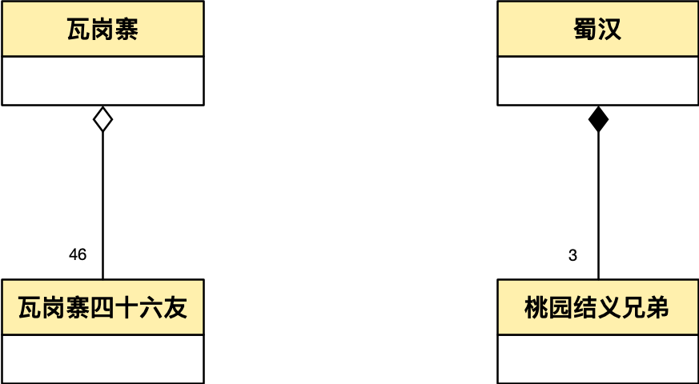
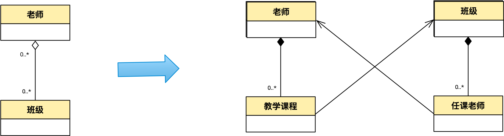

## 观点（太长不读版）

UML的聚合描述的是对象间的关系，分为两种：一种是 **共享聚合** 就是我们常说的聚合，一种是 **组成聚合** 即为组合。共享聚合常常是没想清楚的关系（常常是多对多），是建模中的坏味道不建议使用。UML的聚合是一种技术实现，描述的是技术方案而不是现实世界的关系。DDD的聚合模式是一种对象分组的方法，DDD里的聚合是指一个具备 **固定规则** （一种业务约束）的对象组，对象组内对象之间的 **关系** 是组合。在DDD出现之前，技术人员凭经验区分实现代码中使用关联还是使用组合，而DDD的聚合模式提供了一种通过识别对象间的 **固定规则** 这种业务约束的方式指导哪些情况下更适合使用 **组合** 。

## 耳熟能详的概念

说起组合和聚合这两个概念，我最早接触是从面试八股中，只记得从网络上找到的Java程序员面试指南上说当面试官问起你什么是"组合"什么是"聚合"的时候，答题的要点是同 **生命周期** 为组合，不同 **生命周期** 为聚合。至于什么是 **生命周期** ，常举的例子是汽车和轮胎在汽车报废了以后轮胎仍然可以被装在其他车上，而人的大脑随着人死了大脑也就死了。听上去蛮有浪漫主义风格的：桃园三结义的"不求同年同月同日生、但求同年同月同日死"的对象们算作组合，互相关联但是又没有这么义气的瓦岗一炉香的对象们算作聚合。好像聚合天生就有点贬义。然后联系到UML图，实心的是组合、虚心的是聚合，你看连图都显得不那么仗义。 **生命周期** 成了面试中的关键词，一旦答出来了，面试人员会假装自己懂了，面试官也假装面试人员懂了。

_**[** __**图**__ **1]**_ _ **宁学桃源三结义，不学瓦岗一炉香** _

## DDD 的聚合

后面又接触了DDD，DDD里也有个聚合，但很明显，DDD的聚合跟UML的聚合不是一回事儿，从英文单词上，DDD聚合是aggregate，而UML的聚合是aggregation 。两者在语义上有差别：

- aggregation：指将单独的元素汇集在一起，形成一个更复杂的结构。在软件工程中，聚合用于描述一个对象包含多个对象的关系，这些对象可以独立存在。
- aggregate：指由许多不同的元素或部分组成的整体，通常以其大小或复杂性为特征。在软件工程中，aggregate用于描述作为单个单元绑在一起的对象簇。

单从名字看，两者就有差异，aggregation 是一种关系描述，而aggregate则是一组对象的统称。

DDD中对于聚合的定义："在具有复杂关联的模型中，要想保证对象更改的一致性是很困难的。不仅互不关联的对象需要遵守一些固定规则（Invariants），而且紧密关联的各组对象也要遵守一些固定规则（疑翻译有误：需要维护适用于密切相关的对象组的Invariant[不变量]，而不仅仅是离散的对象）。然而，过于谨慎的锁定机制又会导致多个用户之间毫无意义地互相干扰，从而使系统不可用。(因此)我们应该将 ENTITY和 VALUE OBJECT分 门 别 类地 聚集 到 AGGREGATE中 ，并定义每个AGGREGATE的边界。在每个AGGREGATE中，选择一个ENTITY作为根，并通过根来控制对边界内其他对象的所有访问。只允许外部对象保持对根的引用。对内部成员的临时引用可以被传递出去，但仅在一次操作中有效。由于根控制访问，因此不能绕过它来修改内部对象。这种设计有利于确保AGGREGATE中的对象满足所有固定规则，也可以确保在任何状态变化时AGGREGATE作为一个整体满足固定规则。"[Eric Evens,领域驱动设计：软件核心复杂性应对之道]。

看上去，DDD的聚合更像是为了管理一些对象间的固定规则而采用的一刀切（整体处理而不是分别处理，总是当作一组来处理）的解决方案。

DDD实操过程中，识别聚合是两个条件：

1. 整体部分关系，一个对象是另一个对象的一部份。
2. 对象之间存在 **固定规则** ，具体来说就是一个对象的属性与另一个对象的属性存在业务上的逻辑规则，这个逻辑规则还必须时刻保持。

## DDD聚合与UML聚合

显然UML的聚合和DDD的聚合不是指的同一个概念，对应的单词aggrate 和aggregation也不同，有没有可能是指同一个东西呢？从简单的生命周期定义就会发现不对，因为aggregation是 **不同生命周期** 的一组对象之间的关系，而aggrate是整存整取的对象组，那么UML的组合与DDD的聚合是否是同一个概念呢？

在DDD原书中，聚合是一种管理对象生命周期的一种技术，而同时UML的组合和聚合的重要区分就是生命周期是否一致，而组合就是一种同生命周期的对象关系，那么DDD聚合中的对象之间的关系是不是就是组合呢？

DDD的聚合里的对象有没有可能不具备 **相同的生命周期** 呢？比如说，聚合根生命周期已经结束了，但聚合里的部分还在，还真让我找到了这样的例子：

**假设一个在线购物平台，用户在平台上可以下订单购买商品。在下订单的过程中，用户可以选择多个商品，每个商品对应一个订单行。然而，有时候用户在下订单时，可能会出现误操作，把某个商品放到了错误的订单中，这时候用户希望能够将这个订单行转移到另一个订单中，而不是取消整个订单重新下单。**
**在这个业务场景中，订单行可以转移到另一个订单下。实现的方法可以是，允许用户在订单详情页面中对某个订单行进行编辑，然后选择将订单行转移到另一个订单中。在进行转移操作时，需要检查目标订单的库存是否足够，以免出现库存不足的情况。转移成功后，需要对原订单和目标订单进行相应的更新操作，包括订单总价的重新计算等。**
**这个功能可以提升用户体验，减少误操作带来的不便，同时也可以提升平台的运营效率，避免重复订单的产生。**

首先，订单和订单行因为要保持价格上的 **固定规则** ，因此订单和订单行可以采用DDD的聚合模式，进行分组而识别为聚合根，但是看上去订单行和订单的 **生命周期** 并不总是一致。用生命周期这种判断标准不那么准确了。

## UML组合与UML聚合

这个时候越来越发现，好像组合和聚合的区分出了问题，生命周期这个概念太模糊了。为此我决定找到UML中聚合和组合的原始定义。

在UML的官方文档中，aggregation是用在当一个对象是另一个对象的属性的时候，这个时候对于这个属性UML中会有个枚举值AggregationKind描述这两个对象间的关系，在 UML规范 中，AggregationKind 是一个枚举类型，用于表示聚合关系的类型，它包括三个枚举值：

1. none：表示不是聚合关系，两个对象之间没有整体与部分的关系。
2. shared：表示聚合关系，整体与部分之间的关系是共享的。共享聚合关系表示整体和部分之间是"多对X"（多对多或者多对一）的关系，部分可以属于多个整体，但整体可以有一个或者多个部分。
3. composite：表示组合关系，整体与部分之间的关系是强耦合的。组合聚合关系表示整体和部分之间是"一对多"的关系，部分只能属于一个整体。

多对多关系是领域建模的杀手，但在有些地方却会是消除系统耦合的钥匙。多对多关系的出现，说明没有理清业务，多对多关系往往隐藏着一对多的中间模型。而共享聚合中的多对一也存在这样的情况，往往代码中的遍历方向是自少的一方到多的一方，而不是自多的一方到少的一方，与多对多的情况类似。以班级和老师，一个老师可以教多个班级，而一个班级会有多位老师为例，针对这种情况没有加以分辨，这样的建模是无效的，一方面多对多的关系会使实现和维护变得很复杂，例子中导致班级和老师的 **业务耦合** ，会相互影响，更新班级的一些跟老师无关信息的时候，是否会影响老师，反之亦然，另一方面多对多很少能表示出 **关系的本质** ，班级和老师的关系分别是老师给某个班级授课，以及班级的任课老师，这是老师和班级的关系的更接近本质的描述，用多对多是难以表述出来的。

因此，根据实际分析出的业务本质，准确的打开多对多和多对一关系，找出中间的关联对象的业务语义从而让模型更能表达业务和高内聚低耦合。

_**[** __**图**__ **2]**__ **组合拆分成聚合** _

显然常规语义下的UML聚合，即共享聚合不应该出现在建模中， **UML**** 聚合就不应该出现在任何建模图中**。就如Jim Rumbaugh所说："把它看做建模安慰剂。"[Rumbaugh， UML Reference]

这个时候，生命周期这个说法可能就失去其指导意义了，那么什么是组合（composition）呢？《UML和模式应用》[Craig Larman]和《UML精粹》[Martion Fowler]中给出了较为精确的定义，组合满足三个条件：

1. 部分在同一个时间内必须只属于一个实体，在转单的例子中，订单行虽然属于两个订单，但是同一时间内只属于一个。
2. 部分不能游离于整体存在，即在转单的例子中，订单行只能属于订单之下，而不能独立于订单存在，假设业务上存在游离态的订单行，则不成为组合。
3. 删除整体的时候会级联删除（当前属于这个整体的）部分，在转单的例子中，被转出单删除的时候，已经转出的订单行不会收影响，但未转出的订单行需要级联删除。

_**[** __**图三**__ **]**__ **生命周期** _

显然，那个存在不同生命周期的订单和订单行，仍然是一个组合关系。

## DDD聚合与UML组合

那这个时候，DDD聚合模式和UML组合之间的关系应该也清晰了。UML的组合（composition）显然满足DDD中对聚合（aggregate）的处理。

在UML广泛应用的RUP的开发过程中，存在 **领域模型** 和 **设计模型** 两类模型。"在UP中，术语 **领域模型** 指的是对现实世界概念类的表示，而非软件对象的表示。该术语并不是指用来描述软件类、软件架构领域层或有职责软件对象的一组图。"[Craig Larman, UML 与应用模式]而设计模型包括类图、时序图等等跟技术实现高度相关的部分，显然，在RUP中，领域模型和设计模型之间可能存在差异，在领域模型中可能出现多对多关系，需要在设计模型中凭借架构师的聪明才智解决，这个时候把类之间的关系设计为 **关联** （association）还是 **组合** （composition）是一个不可言说的知识，同时一些二把刀架构师，没能掌握对多对多关系设计的技巧，就会武断的设计为 **聚合** （aggregation）[即shared aggregation]。

而众所周知，DDD追求的是建模一套DDD概念下的 **领域模型** 兼容RUP中的领域模型和设计模型，"软件系统各个部分的设计应该忠实地反映领域模型，以便体现出这二者之间的明确对应关系。我们应该反复检查并修改模型，以便软件可以更加自然地实现模型，即使想让模型反映出更深层次的领域概念时也应如此。"[Eric Evens ,领域驱动设计 软件核心复杂性的应对之道]，那么DDD的 **聚合模式** ，就是通过挖掘深层需求，将是否使用 **组合** （composition）在领域建模阶段就确定下来，实现方式就是寻找对象之间的关系，之所以要把对象之间的关系设计为 **组合** ，原因是因为对象之间存在 **固定规则** （Invariants）的约束，从而将其用aggregate的方式封装起来，内部对象之间的关系就是 **组成聚合** （composition aggregation）也就是 **组合** （composition）。

这是一个不可言说知识显示化的过程，当然与所有不可言说知识显示化的过程一样，都会失去一些什么，比如按照 **固定规则** 划分出来的聚合（aggregate）可能过于肥大[聚合肥大症，[**聚合肥大症**](https://mp.weixin.qq.com/s/kguIYUpMDkm-u8Arud0stw)]，或者过于细碎难以管理，往往经验丰富的架构师在凭直觉（不可言说的知识）划的时候有效的规避了这个问题，而按照DDD的聚合模式就难以避免，但对于建模新手来说，DDD的聚合模式显然比凭直觉划更容易掌握。